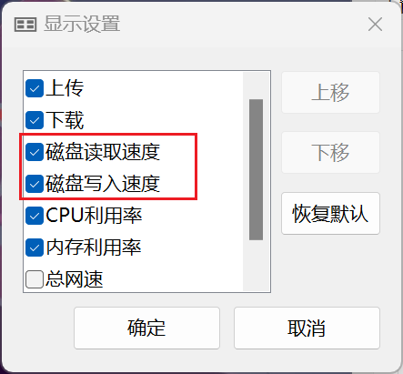
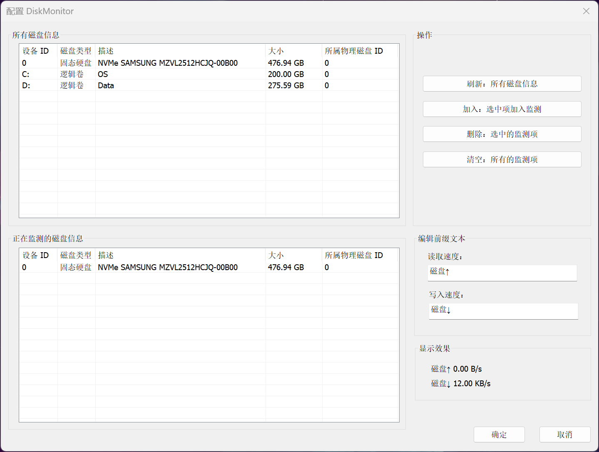

## DiskMonitor

一个用于 [TrafficMonitor (zhongyang219/TrafficMonitor)](https://github.com/zhongyang219/TrafficMonitor/) 的插件，可以实时监测磁盘读写速率。

**由于需要获取磁盘信息和磁盘性能信息，运行此插件需要管理员权限**

### Usage

- 用 Visual Studio 2022 打开解决方案；
- 生成项目 `DiskMonitor`；
- 将生成的 `DiskMonitor.dll` 复制到 TrafficMonitor.exe 所在目录的 `plugins` 子目录下
  - 没有就新建一个；
- 在 "TrafficMonitor > 选项 > 任务栏窗口设置 > 显示设置" 里，勾选 "磁盘读取速度" 和 "磁盘写入速度"；
- 你可以在 "TrafficMonitor > 选项 > 任务栏窗口设置 > 显示文本设置" 里更改前缀文本；

### Screenshots

其实就是添加了两个额外的显示项目到 TrafficMonitor：

可以像其他项目一样设置显示文本，数值格式为两位小数，自动计算单位；

最终效果（中间两个）：

在插件配置页面，可以配置想要监测的磁盘，支持物理磁盘和逻辑磁盘（卷）：

### Note

- 推荐你使用 **任务栏窗口**，配置更方便；如果要使用 **主窗口**，需要你自定义一个皮肤，才能显示插件项目；
  - [皮肤制作教程 · zhongyang219/TrafficMonitor Wiki (github.com)](https://github.com/zhongyang219/TrafficMonitor/wiki/皮肤制作教程#plugin_map节点)
- 在插件配置页面，"编辑前缀文本" 所设置的值并不会显示出来，它只是**作为示例，方便 TrafficMonitor 计算要预留的宽度**，推荐你把这两项和在 "显示文本设置" 里设置的保持一致；